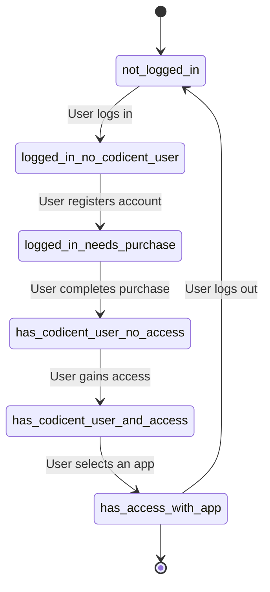

# Application State Documentation

This document outlines the various states, transitions, and actions within the application.

## State Diagram

## States and Transitions

### 1. `busy`

- **Description**: The application is performing background tasks or waiting for data.
- **Transitions**:
  - Remains in `busy` until tasks are complete.
  
### 2. `not_logged_in`

- **Description**: The user is not authenticated.
- **Actions**:
  - User can log in.
- **Transitions**:
  - On successful login, transitions to `logged_in_no_codicent_user`.

### 3. `logged_in_no_codicent_user`

- **Description**: The user is authenticated but does not have a Codicent account.
- **Actions**:
  - User can register a Codicent account.
- **Transitions**:
  - After registration, transitions to `logged_in_needs_purchase`.

### 4. `logged_in_needs_purchase`

- **Description**: The user needs to complete a purchase to access the application features.
- **Actions**:
  - User can complete the purchase process.
- **Transitions**:
  - On successful purchase, transitions to `has_codicent_user_no_access`.

### 5. `has_codicent_user_no_access`

- **Description**: The user has a Codicent account but does not have access to any apps.
- **Actions**:
  - User can request access or create a new app.
- **Transitions**:
  - On gaining access, transitions to `has_codicent_user_and_access`.

### 6. `has_codicent_user_and_access`

- **Description**: The user has a Codicent account and access to one or more apps.
- **Actions**:
  - User can select an app to proceed.
- **Transitions**:
  - On selecting an app, transitions to `has_access_with_app`.

### 7. `has_access_with_app`

- **Description**: The user has selected an app and has access to it.
- **Actions**:
  - User can interact with the app's features.
  - User can log out.
- **Transitions**:
  - On logout, transitions to `not_logged_in`.

## Actions

- **Log In**: Authenticate the user.
- **Register Account**: Create a Codicent account for the user.
- **Complete Purchase**: User completes the payment process.
- **Request Access**: User requests access to an app.
- **Select App**: User selects an app to use.
- **Log Out**: User logs out of the application.